# 🖥️ Awesome Server Operating System 🐧

  

  
  
  
  
  <a href="https://github.com/ishandutta2007">i</a>

> **Curated Directory of Enterprise Server Operating Systems, Cloud-Optimized Platforms, Linux Distributions, and BSD Infrastructure Ecosystems.**  
> *Everything you need to select, deploy, and scale high-availability server operating systems in production, cloud, and enterprise environments.*

---

## 📚 Table of Contents
- [🌐 Market Size & Industry Landscape](#-market-size--industry-landscape)
- [🏢 SaaS & Commercial Server Platforms](#-saas--commercial-server-platforms)
- [🔓 Open-Source GitHub Projects](#-open-source-github-projects)
- [🛠️ How to Contribute](#️-how-to-contribute)
- [☕ Support](#-support)
- [⚠️ Disclaimer](#️-disclaimer)
- [⭐ Star History](#-star-history)

---

## 🌐 Market Size & Industry Landscape

> **Market Insights**: The global Server Operating System market size was valued at approximately **\$16.4 Billion in 2023** and is projected to reach **\$38.7 Billion by 2032** (growing at a CAGR of ~10.1%). The sector is **concentrated (winner-take-most)** in commercial enterprise environments dominated by Microsoft Windows Server and Red Hat Enterprise Linux (RHEL), while remaining **moderately fragmented** across community-driven Linux distributions, specialized hypervisors, and security-focused BSD operating systems.

---

## 🏢 SaaS & Commercial Server Platforms

The table below summarizes leading commercial server operating systems sorted by **Company Size / Valuation (Descending)**:

| Platform | Provider / Vendor | Company Size / Valuation | Starting Tier Pricing | Free Tier / Trial Limit | Key Focus & Ideal Use Case |
| :--- | :--- | :--- | :--- | :--- | :--- |
| **[Windows Server 2022](https://www.microsoft.com/en-us/windows-server)** | Microsoft | **\$3.1 Trillion** (Market Cap) | \$504 (Essentials 10-core) / \$1,060 (Standard 16-core) | **180-Day Free Trial** (Evaluation Edition, rearmable up to 1,080 days) | Active Directory, Hyper-V, Windows Admin Center, enterprise Microsoft stack |
| **[Oracle Linux](https://www.oracle.com/linux/)** | Oracle | **\$480 Billion** (Market Cap) | **\$0 / Free** (Software download & updates); Support starts at \$1,399/yr per CPU pair | **100% Free Forever Software**; OCI includes Always Free Tier + \$300 trial credit | RHEL compatibility, zero-downtime Ksplice patching, Oracle Database optimization |
| **[Red Hat Enterprise Linux (RHEL)](https://www.redhat.com/en/technologies/linux-platforms/enterprise-linux)** | IBM / Red Hat | **\$200+ Billion** (Acquired for \$34B by IBM) | \$383.90 / year (Entry Self-Supported); \$879 / year (Standard Support) | **Free Developer Subscription** (Up to 16 nodes for testing) or **60-Day Trial** | The enterprise Linux standard, 10-year lifecycle, mission-critical workloads |
| **[SUSE Linux Enterprise Server (SLES)](https://www.suse.com/products/server/)** | SUSE | **\$2.8 Billion** (Market Cap / Valuation) | \$0.06 / hour (Cloud On-Demand) or ~\$800 / year (Standard Subscription) | **60-Day Free Evaluation** with free patches & maintenance | SAP HANA optimization, 13-year long-term support, European enterprise standard |

---

## 🔓 Open-Source GitHub Projects

Below are top-tier open-source server operating systems, storage platforms, hypervisors, and distribution projects, sorted by **GitHub_Stars (Descending)**. Each Stars_Count badge links directly to the project's stargazers page:

| Repository / Project | GitHub_Stars | Category | Key Features & Highlights |
| :--- | :---: | :--- | :--- |
| **[OpenWrt](https://github.com/openwrt/openwrt)** |  | Embedded Server & Router OS | Linux operating system targeting embedded server devices and networking gateways. |
| **[NixOS (nixpkgs)](https://github.com/nixos/nixpkgs)** |  | Declarative Server OS | Reproducible Linux distribution built on declarative configuration and atomic upgrades. |
| **[Rocky Linux](https://github.com/rocky-linux/rocky)** |  | Enterprise RHEL Rebuild | 1:1 binary-compatible RHEL alternative governed by the RESF community foundation. |
| **[FreeBSD](https://github.com/freebsd/freebsd-src)** |  | Enterprise BSD Operating System | High-performance Unix OS featuring native ZFS support, Jails containerization, and network stack. |
| **[Arch Linux Installer](https://github.com/archlinux/archinstall)** |  | Minimal / Custom Server Base | Lightweight installer script for building custom, rolling-release server environments. |
| **[OpenMediaVault](https://github.com/openmediavault/openmediavault)** |  | Storage & NAS OS | Debian-based Network Attached Storage (NAS) solution with web admin, plugins, & Docker support. |
| **[OpenBSD](https://github.com/openbsd/src)** |  | Security-Focused BSD | Ultra-secure BSD operating system emphasizing proactive cryptography, OpenSSH, & firewalls. |
| **[cloud-init](https://github.com/canonical/cloud-init)** |  | Cloud Provisioning Tool | The standard multi-distribution package for cloud instance initialization and setup. |
| **[Flatcar Container Linux](https://github.com/flatcar/flatcar)** |  | Container-Optimized OS | Immutable, auto-updating Linux distribution designed specifically for running containerized workloads. |
| **[Alpine Linux (aports)](https://github.com/alpinelinux/aports)** |  | Minimal Lightweight Server OS | Security-oriented, ultra-lightweight Linux distribution based on musl libc and BusyBox. |
| **[Clear Linux](https://github.com/clearlinux/distribution)** |  | Performance-Optimized OS | Intel-backed Linux distribution engineered for maximum hardware performance and cloud optimization. |
| **[TrueNAS SCALE UI](https://github.com/truenas/webui)** |  | Enterprise Storage OS | Open-source hyperconverged storage OS built on Debian with OpenZFS and Kubernetes/Docker. |
| **[AlmaLinux](https://github.com/AlmaLinux/docker-images)** |  | Enterprise RHEL Rebuild | Enterprise-grade, 1:1 RHEL-compatible distribution with non-profit community backing. |
| **[Debian](https://github.com/Debian/debian)** |  | Universal Server OS | The rock-solid open-source base for Ubuntu, Raspberry Pi OS, and enterprise cloud deployments. |
| **[Proxmox VE Manager](https://github.com/proxmox/pve-manager)** |  | Virtualization Platform | Complete open-source virtualization management platform combining KVM hypervisor & LXC containers. |

---

## 🛠️ How to Contribute

Contributions are welcome! Follow these steps to submit additions or updates:

1. **Fork** the repository.
2. Edit `README.md` following the existing markdown table format.
3. Ensure details (pricing, Stars_Counts, links) are verified.
4. Submit a **Pull Request** with a clear title and description.

---

## ☕ Support

If you find this repository helpful, please consider supporting the project:

- ⭐ **Star** this repository to increase visibility.
- 🔀 **Fork** it to keep your own reference.
- 📢 **Share** it with your network of DevOps engineers and system administrators.
- 💖 **Sponsor / Buy me a coffee**: Show your appreciation on the [GitHub Sponsor Dashboard](https://github.com/sponsors/ishandutta2007).

Thank you for supporting open-source server operating system initiatives!

---

## ⚠️ Disclaimer

- This is a **community-curated list** provided for informational purposes.
- Server operating systems require security hardening, patching, and compliance auditing before production deployment.
- Product logos, trademarks, and brand names belong to their respective owners.

---

## ⭐ Star History

